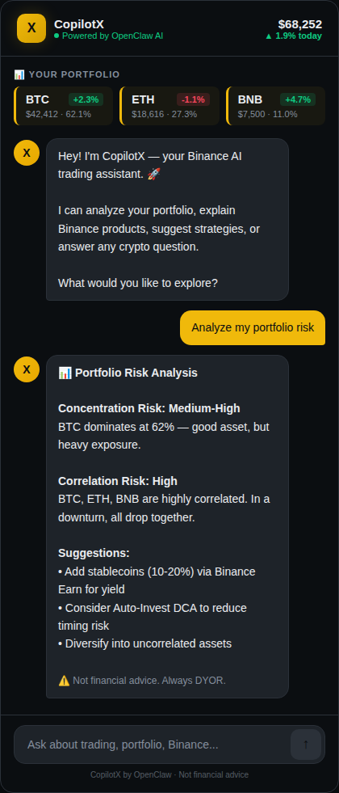

# CopilotX — AI Trading Assistant for Binance

> Built with OpenClaw for the #AIBinance challenge

CopilotX is an AI-powered trading copilot that enhances the Binance experience through a conversational interface. It analyzes portfolios, explains Binance products, provides market insights, and suggests trading strategies.



## Features

- **Portfolio Analysis** — Real-time breakdown of holdings with risk assessment
- **Binance Product Guide** — Explains Spot, Futures, Earn, Launchpad, Auto-Invest, Copy Trading
- **Market Sentiment** — AI-driven trend and sentiment analysis
- **Strategy Builder** — Personalized DCA plans, position sizing, entry/exit strategies
- **Crypto Education** — From beginner basics to advanced trading concepts
- **Multilingual** — Responds in whatever language you write in

## How It Works

CopilotX is a React component that connects to Claude API (via OpenClaw) to provide intelligent, context-aware responses about Binance products and crypto trading.

### Quick Start (Claude.ai Artifact)

The simplest way to run CopilotX is as a Claude.ai artifact — just paste the contents of `copilotx.jsx` into a new React artifact. The API connection is handled automatically.

### Standalone Setup

To run outside Claude.ai you need an Anthropic API key:

1. Clone this repo
2. Install dependencies:
   ```bash
   npm install react react-dom
   ```
3. Set your API key as an environment variable:
   ```bash
   export ANTHROPIC_API_KEY=your_key_here
   ```
4. Integrate `copilotx.jsx` into your React project (Vite, Next.js, CRA, etc.)

> **Note**: When running standalone, you'll need a backend proxy to securely pass the API key. Never expose your API key on the frontend.

## Tech Stack

- React (functional components + hooks)
- Claude API (claude-sonnet-4-20250514) via OpenClaw
- Pure CSS (no external UI libraries)
- Binance-native dark theme

## Project Structure

```
├── copilotx.jsx    # Main React component (self-contained)
├── README.md       # This file
└── screenshot.png  # Demo screenshot
```

## License

MIT

---

Built for the [Binance x OpenClaw AI Challenge](https://www.binance.com/) #AIBinance
